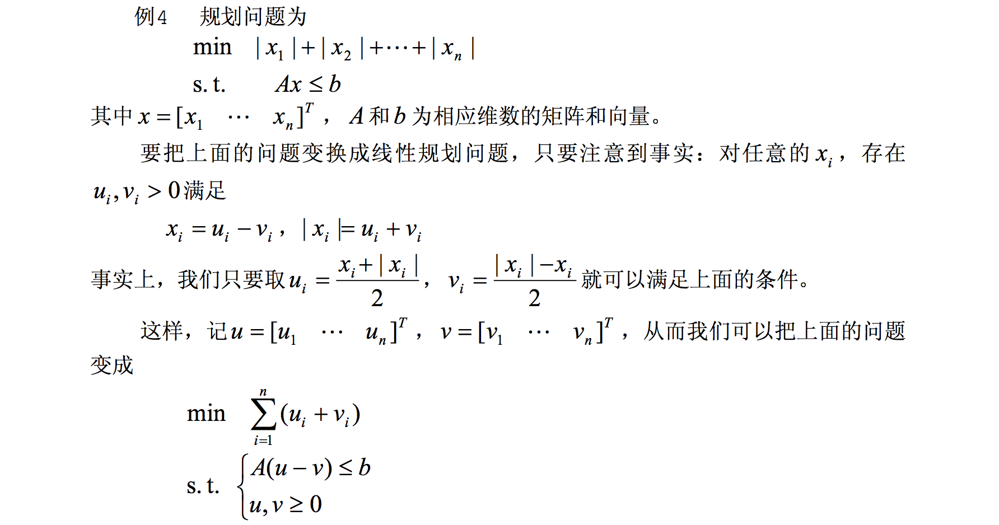
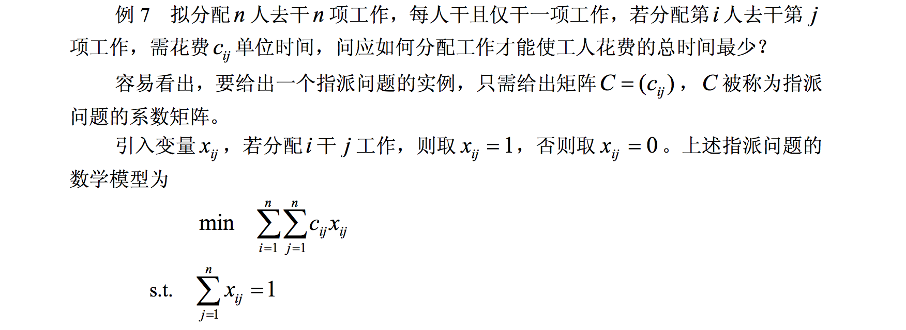

# 线性规划

## 定义

根据一系列约束条件求解相关的目标函数的问题。例如：


## 解决方案

### 图解法

二维可使用，比如上面的例1.1，但是多元不易使用，而是扩展出一个**凸集**的定义，理论上来说最优解一定位于凸集的顶点。


### matlab解法

matlab中的线性规划标准型为：


如果是求最大值: 


基本函数形式为 `linprog(c, A, b)` , 返回值是向量 `x` 的值，另外还有其它的函数调用形式：

```matlab
[x, fval] = linprog(c,A,b,Aeq,beq,LB,UB,x0,OPTIONS)
% fval是目标函数值，LB，UB分别是x的下界和上界，x0是变量初始值，OPTIONS是控制参数
```

简单来说，c是目标函数系数的列向量，A是约束条件系数矩阵，b是约束条件偏置的相反数，Aeq是总量控制系数矩阵，beq是总量控制偏置相反数。


## 例题

### 标准形式


```matlab
c = [2;3;-5];
a = [-2,5,-1; 1,3,1];
b = [-10; 12];
aeq = [1,1,1];
beq = [7];
x=linprog(-c,a,b,aeq,beq,zeros(3,1));
value = c'*x
```

> zeros(3,1)作用是生成了3x1的全0矩阵，但是为什么这么用还不清楚
>
> 总量控制不清楚时，aeq和beq需要传[]


### 变相题



- 当 `xi` 为正的时候，`ui = xi` , `vi = 0`. 
- 当 `xi` 为负的时候，`xi = ui - vi, -xi = ui + vi` , 即 `ui = 0, vi = -xi`.

这么推理不是什么困难的事，困难的是将绝对值的情况抽象成两个数值的运算，从而消除绝对值的0点阶跃性(我编的QwQ)。而只要将绝对值和本体抽象成两个数值之间的加减运算，把带绝对值的目标函数转换成不带绝对值的目标函数，从而转换成LP问题


### 应用题

众所周知，数学建模是为了解决实际问题，那么把扩散到实际中的数学问题提炼出来变成熟悉的模型就是必须做的事。

#### 1. 产销平衡


需要注意的是 `xij >= 0` 这个条件，容易漏写

#### 2. 0-1规划




指派问题的本质是一对一，像这样的问题比较不容易联想，但其实我们需要注意一堆0相加的结果也是0，因此能够构造出总量控制条件。

而解决这样的问题的关键还在于C矩阵，匈牙利算法如是说：

**如果系数矩阵 C = (cij ) 一行(或一列)中每一元素都加上或减去同一个数，得到一个新矩阵 B = (bij ) ，则以 C 或 B 为系数矩阵的指派问题具有相同的最优指派。**

今天先写到这里了，不想写了 